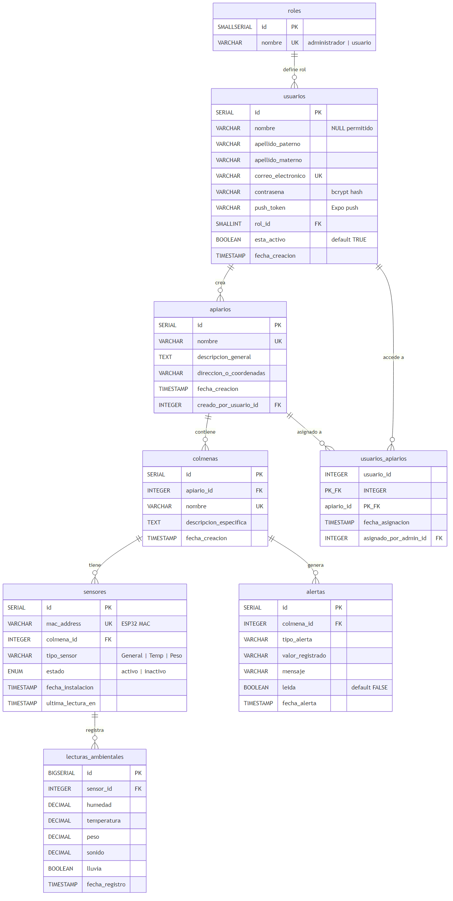
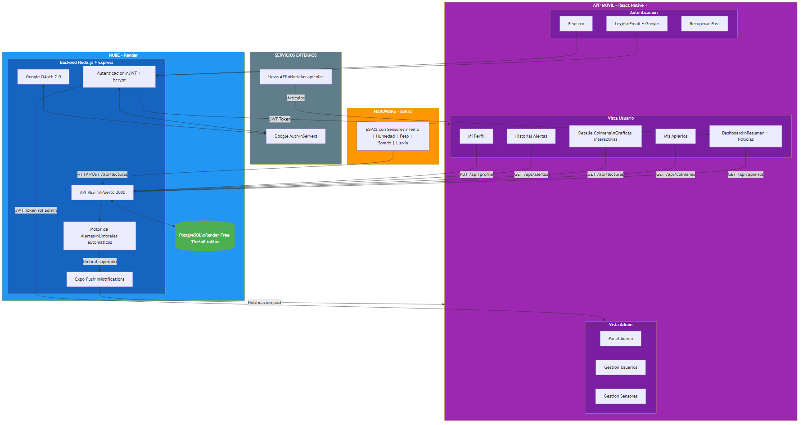
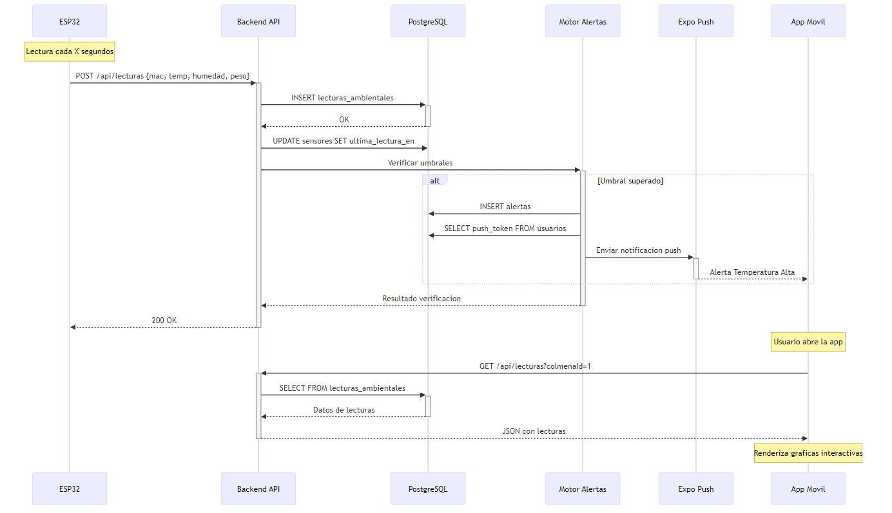

# 📊 Diagramas del Sistema AbejaNet

---

## 1. Diagrama UML de Base de Datos (Entidad-Relación)



**Tablas:** `roles`, `usuarios`, `apiarios`, `colmenas`, `usuarios_apiarios`, `sensores`, `lecturas_ambientales`, `alertas`

---

## 2. Diagrama de Flujo del Sistema



**Capas:** Hardware (ESP32) → Nube (Backend + PostgreSQL en Render) → App Móvil (React Native + Expo)

---

## 3. Diagrama de Secuencia: Flujo de Lectura de Sensor



**Flujo completo:** ESP32 envía datos → Backend procesa y guarda → Verifica umbrales → Envía alerta push si es necesario → Usuario consulta gráficas

---

## Código Fuente (Mermaid)

Los archivos fuente `.mmd` están en la carpeta `diagrams/` por si necesitas editarlos:

- `diagrams/er_diagram.mmd` — Diagrama Entidad-Relación
- `diagrams/flow_diagram.mmd` — Diagrama de Flujo del Sistema
- `diagrams/sequence_diagram.mmd` — Diagrama de Secuencia

Para re-generar las imágenes después de editar:
```powershell
npx -y @mermaid-js/mermaid-cli -i diagrams/er_diagram.mmd -o diagrams/er_diagram.png -w 1600 -b white
npx -y @mermaid-js/mermaid-cli -i diagrams/flow_diagram.mmd -o diagrams/flow_diagram.png -w 1800 -b white
npx -y @mermaid-js/mermaid-cli -i diagrams/sequence_diagram.mmd -o diagrams/sequence_diagram.png -w 1400 -b white
```
